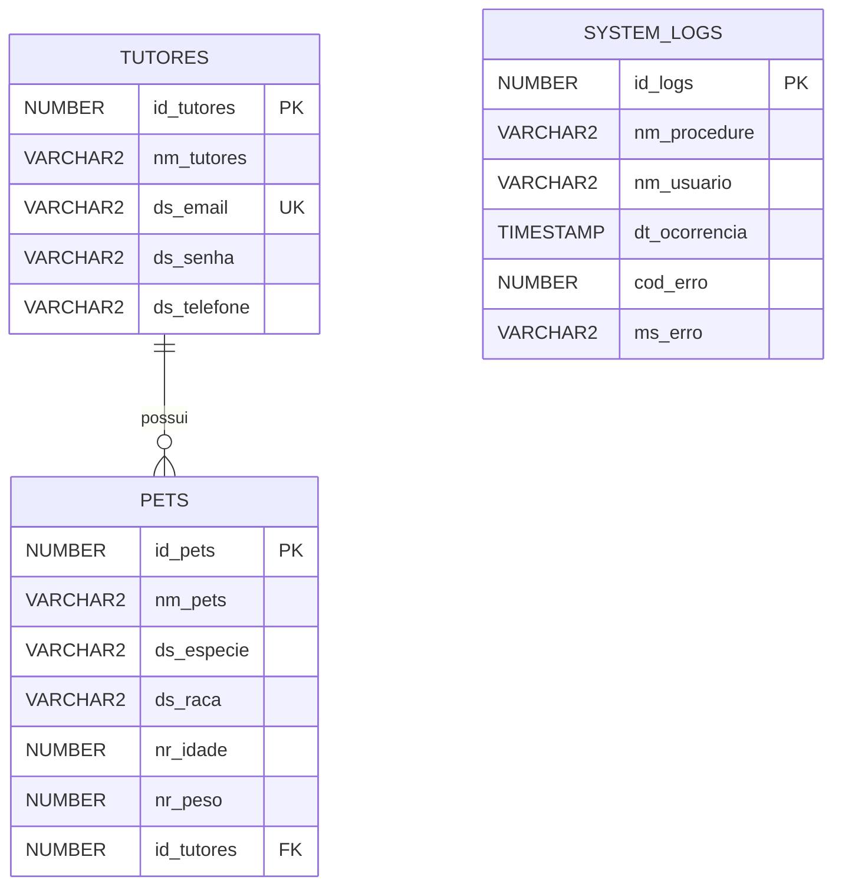
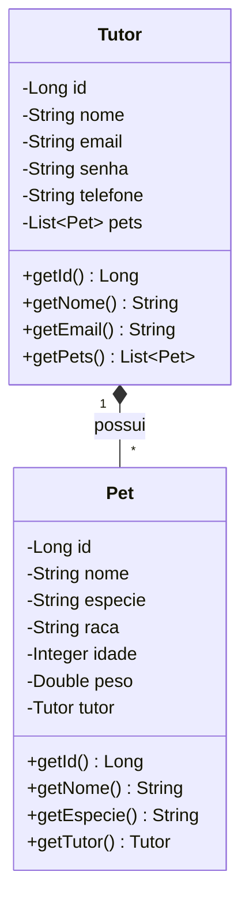

# Diagramas de Arquitetura - Projeto Zelo

## 1. Diagrama Entidade-Relacionamento (DER)

## 2. Diagrama de Classes de Entidade

## 3. Explicação dos Relacionamentos e Constraints

### Relacionamento Tutor -> Pet (1:N)
- Um **Tutor** pode ter vários **Pets** (relação de um para muitos).
- Um **Pet** pertence a apenas um **Tutor**.
- No banco de dados, isso é representado pela Foreign Key `id_tutores` na tabela `t_ch_pets`, referenciando a Primary Key `id_tutores` da tabela `t_ch_tutores`.
- No JPA, isso é mapeado usando as anotações `@OneToMany` na classe `Tutor` e `@ManyToOne` na classe `Pet`.

### Constraints Principais
- **Primary Keys:** `id_tutores` e `id_pets` são chaves primárias auto-incrementais (Identity).
- **Unique:** O campo `ds_email` na tabela de tutores é único, garantindo que não existam contas duplicadas.
- **Not Null:** Campos essenciais como nome, email, senha (Tutor) e nome, espécie (Pet) são obrigatórios.
